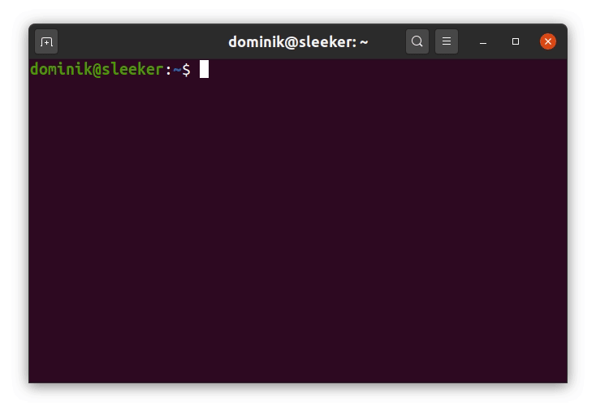

# nconv

<p align="center">
    
</p>

[](https://github.com/dominiksalvet/nconv/actions)
[](https://github.com/dominiksalvet/gitpack)
[](https://pubs.opengroup.org/onlinepubs/9699919799/utilities/V3_chap02.html)

> Binary, decimal, and hexadecimal converter.

Nconv (number converter) is a simple and intuitive tool for converting among binary, decimal, and hexadecimal numbers. It was created with **programmers in mind**. Have a look at its sleek features and convince yourself:

* Smart conversions based on the first number
* Perfect support for **two's complement**
* Numbers may have arbitrary length

To ensure that nconv will work out of the box on as many systems as possible, it was designed as a very portable POSIX Shell script, which also means no need for compilation. Just **install and use** immediately.

## Install

Nconv supports [GitPack](https://github.com/dominiksalvet/gitpack). Local installation/update:

```sh
gitpack install github.com/dominiksalvet/nconv
```

## Usage

**Smart** conversion:

```
nconv <number>
```

> Rules: bin → dec, dec → bin, hex → dec.

**Manual base** conversion:

```
nconv -b/-d/-h -B/-D/-H <number>
```

> Input options are lowercase, output ones are uppercase.

**Manual signedness** conversion:

```
nconv -s/-u <number>
```

> Input is considered to be signed/unsigned.

**Manual width** conversion:

```
nconv -W <width> <number>
```

> Extend output to `<width>` digits. It respects signedness.

### Example

To better imagine how nconv works, there are some examples below:

* Convert a hexadecimal number to a binary number:

```
$ nconv -B face
1111101011001110
```

* Make sure input is always hexadecimal even when smart conversion tells otherwise:

```
$ nconv -h -B 10
10000
```

* Negative numbers are not a problem either:

```
$ nconv -5
1011
```

* Let us extend it to a byte:

```
$ nconv -W 8 -5
11111011
```

* What about to try something bigger?

```
$ nconv -W 8 -255
E13: could not fit 100000001 into 8 digits
```

* Oops, but it would fit without the minus sign, wouldn't it?

```
$ nconv -W 8 255
11111111
```

* Can I store this number into a signed byte variable? Nope.

```
$ nconv -W 8 -s 200
E13: could not fit 011001000 into 8 digits
```

* What is this signed binary number in decimal?

```
$ nconv -s 10011001
-103
```

## Useful Resources

* [support.md](support.md) – questions, answers, help
* [contributing.md](contributing.md) – how to get involve
* [license](license) – author and license
